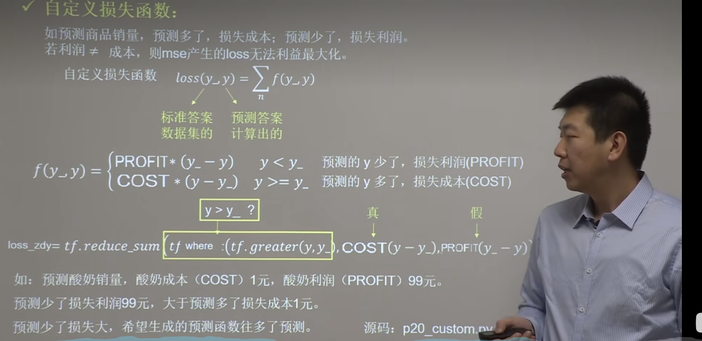
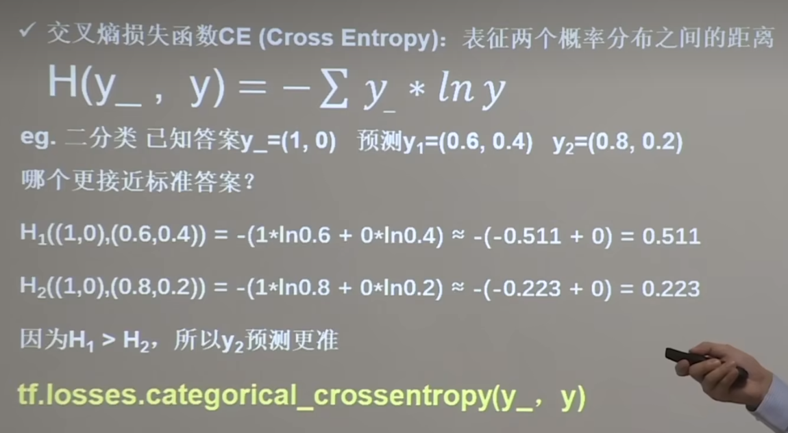
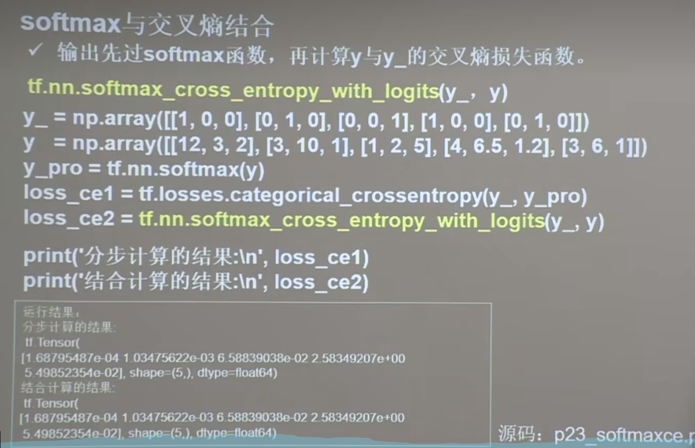
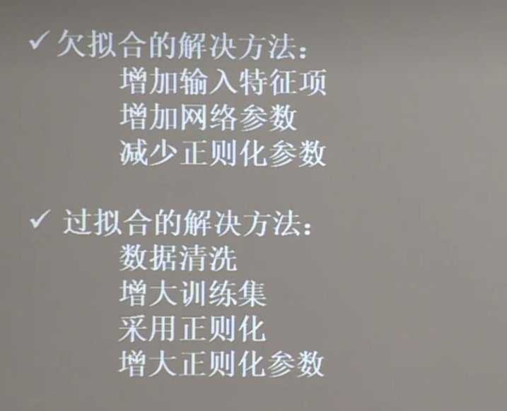
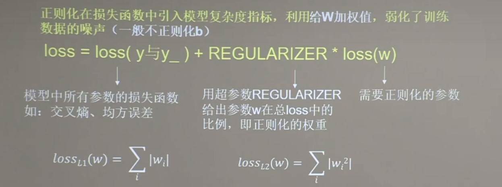

### 一、损失函数： 是预测值y与已知答案(y_)的差距

#### 		NN优化目标：loss最小

#### 1.均方误差(mse):


tensorflow实现代码：

```python
import tensorflow as tf
loss_mse = tf.reduce_mean(tf.square(y_ - y))
```

#### 2.自定义损失函数

##### 例如:在代码中自定义的损失函数：
```python
    # 定义数据
    COST = 1 # 成本
    PROFIT = 99 # 利润
    loss = tf.reduce_sum(tf.where(tf.greater(y,y_),(y-y_) * COST,(y_-y) * PROFIT))
```
#### 3.交叉熵损失函数




### 二、缓解过拟合
#### 1. 定义：
- ##### 欠拟合：不能有效拟合数据集，是对数据集学习的不够彻底

- ##### 过拟合：对当前数据拟合的太好了，但是对从未见过的新数据，却难以做出判断，模型缺乏泛化力。
#### 2. 解决方法：


#### 3.正则化缓解过拟合：
##### 正则化在损失函数中引入模型复杂度指标，利用给w加权重，弱化了训练数据的噪声（一般不正则化b）
##### 一般为如下规则：


##### <font color="#da355c">注意：</font> 
##### L2正则化会使参数很接近0，但是不为零，因此该方法可通过减少参数值的大小降低复杂度。


