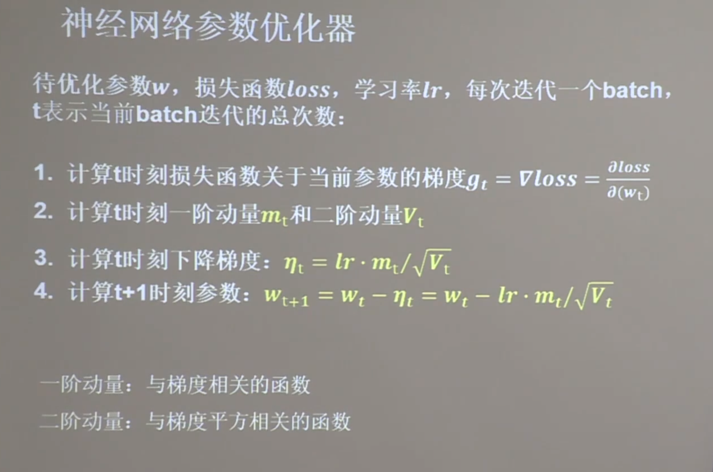
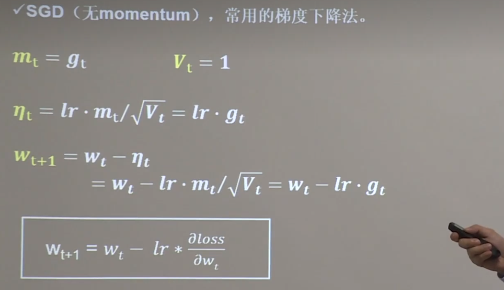
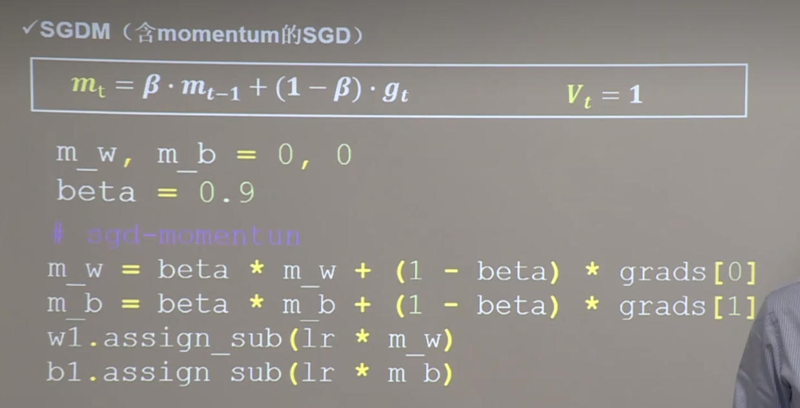
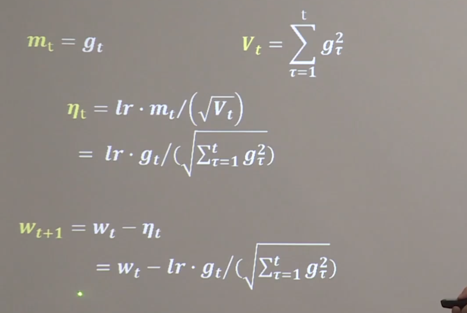
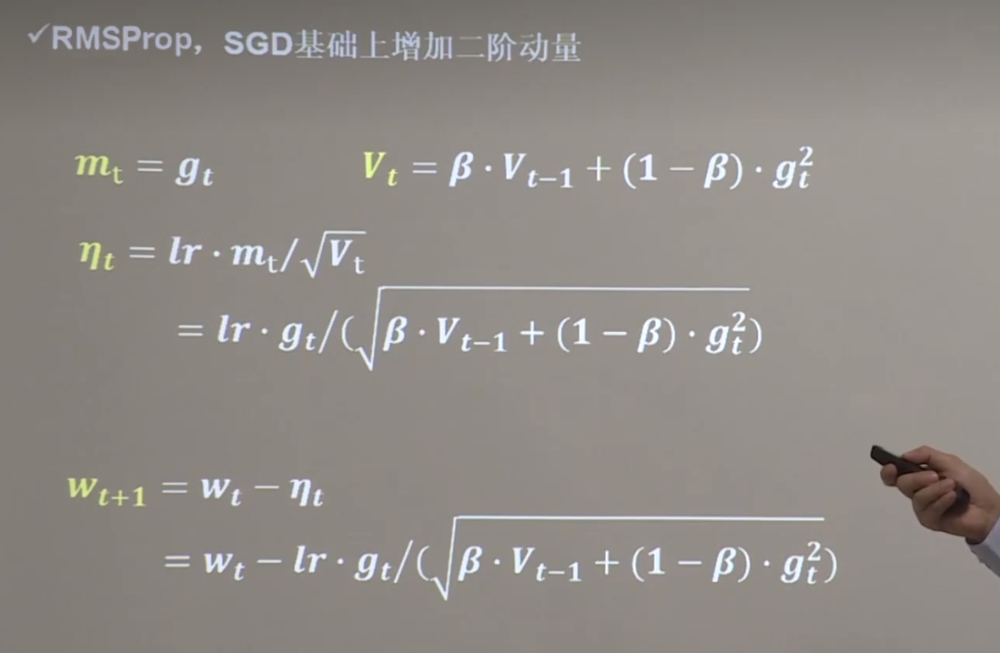
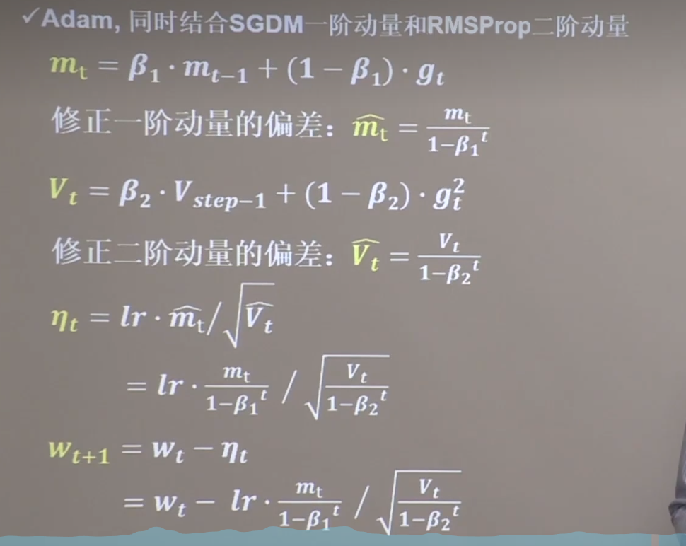
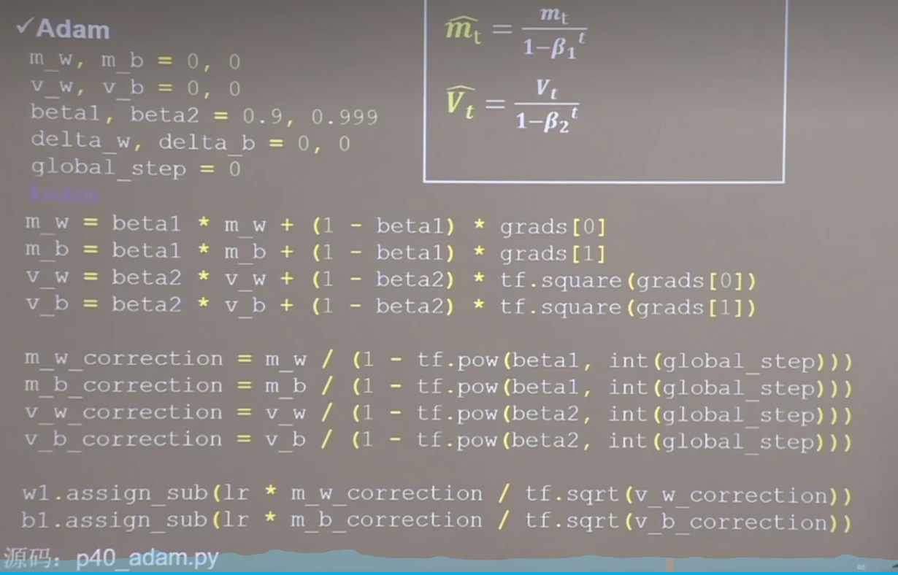

### 神经网络参数优化器
- #### 认识几个参数的含义
  
- #### 随机梯度下降：(SGD)
  
  #### SGD实现的代码
  ```python
  import numpy as np
  w1.assign_sub(lr * grads[0])
  b1.assign_sub(lr * grads[1])
  ```
- #### SGDM：是在SGD的基础上引入一阶动量mt,就是要算出mt
  
- #### Adagrad是在SGD的基础上引入二阶动量
  - #### 参数更新公式：
      
  - #### 代码实现：
  ```python
  import numpy as np
  v_w,v_b = 0,0
  # adagrad
  v_w += tf.square(grads[0])
  v_b += tf.square(grads[1])
  # 带入优化器
  w1.assign_sub(lr * grads[0] / tf.sqrt(v_w))
  b1.assign_sub(lr * grads[1] / tf.sqrt(v_b))
  ```
  
- #### RMSProp，SGD的基础上引入二阶动量(Vt此时是各时刻剃度指数滑动的平方)
  - #### 参数更新公式：
      
  - #### 代码实现：
   ```python
  import tensorflow as tf
  # 定义 w 和 b 的二阶动量初始值为 0，,超参数beta = 0.9
  v_w,v_b = 0,0
  beta = 0.9
  
  # rmsprop
  v_w =beta * v_w + (1 - beta) * tf.square(grads[0])
  v_b =beta * v_b + (1 - beta) * tf.square(grads[1])
  # 带入优化器
  w1.assign_sub(lr * grads[0] / tf.sqrt(v_w))
  b1.assign_sub(lr * grads[1] / tf.sqrt(v_b))
  
  ```
- #### Adam:同时结合SGDM一阶动量和RMSProp二阶动量
  - #### 参数更新公式：
      
  - #### 代码实现：
      