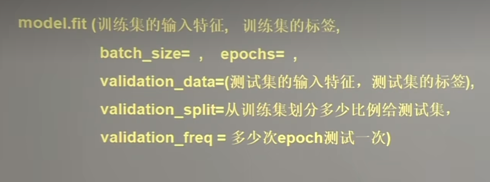

# 使用Sequential搭建网络八股文

##  用tensorflow API:tf.Keras搭建神经网络

### 一、六步法
#### 1. 首先导入需要的包，tensorflow,numpy,sklearn,pandas,matplotlib等
#####        import 各种需要的包
#### 2. 标识需要训练的数据集或测试集
#####       train test
#### 3. 在Sequential中搭建网络结构，逐层表述网络特征，相当于走了一遍前向传播
#####       model = tf.keras.models.Sequential
#### 4. 在compile()中配置训练方法：指定训练的优化器，指定使用的损失函数，指定评测指标。
#####      model.compile
#### 5. 在fit()中执行训练过程：告知训练集合测试集的输入特征和标签,告知每个batch是多少，告知要迭代多少次数据集
#####       model.fit
#### 6. 用summary()打印出网络的结构和参数统计 

### 二、六步法详解：
#### 1.tf.keras.models.Sequential([网络结构])

#### 2.tf.keras.model.compile([网络结构])
#### 3. model.fit(训练集的输入特征，训练集的标签)


4.

### 二、使用classMode搭建网络结构

#### 1.基本思想：作用：实现可跳跃性的非连续的网络


#### 2.具体的实现代码：(p11xxx.py)


### 三、MNIST数据集：
#### 提供6万张28*28像素点的0-9的手写数字图片和标签 用于训练
#### 提供1万张28*28像素点的0-9的手写数字图片和标签 用于测试

```python
import numpy as np
# 导入MNIST数据集：
mnist = tf.keras.datasets.mnist
(x_train,y_train),(x_test,y_test) = mnist.load_data()
# 作为输入特征，输如神经网络的时候，将数组拉伸为一维数组
tf.keras.layers.Flatten()
# 打印mnist数据集的元素查看
# 绘制灰度图
plt.imshow(x_train[0],camp='gray')
# 绘制该图片查看
plt.show()
# 打印训练集第一个数据的输入特征：二维数据，0表示黑色，255表示白色
print("x_train[0]:\n",x_train[0])
# 打印训练集第一个数据的标签：
print("y_train[0]:\n",y_train[0])
# 输出 y_train[0]：5
# 打印测试集的形状：
print("x_test.shape:",x_test.sahpe)
# 输出 x_test.sahpe:(10000,28,28) 一万张28*28的图片
```
### 四、FASHION数据集：

